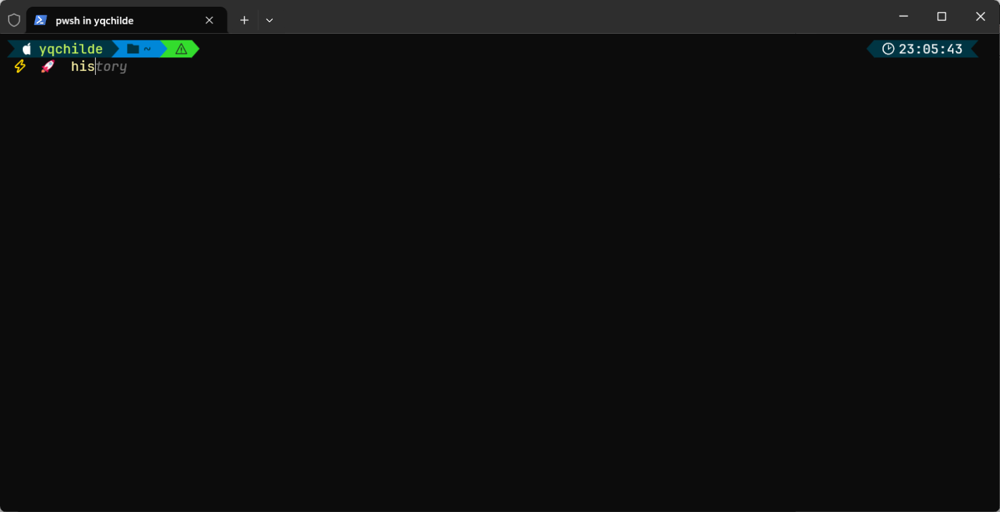

# 美化Windows Terminal并增加自动提示

如果是 Win11 自带了 Windows Terminal，如果是 Win10 先去 Mincrosoft Store 里下载，下载好了进行下列步骤

## 安装Oh-My-Posh

下载地址：[oh-my-posh/releases](https://github.com/JanDeDobbeleer/oh-my-posh/releases)

如图：


安装，安装完成后，打开 Windows Terminal 输入命令`oh-my-posh`，检查是否安装ok

如图：


## 配置Oh-My-Posh

1. 终端执行命令`notepad $profile`，如果报错没有该文件，先执行命令创建 `New-Item -Path $PROFILE -Type File -Force`，如果PowerShell继续阻止运行本地脚本，执行命令设置权限 `Set-ExecutionPolicy -ExecutionPolicy RemoteSigned -Scope LocalMachine`

2. 安装模块

```shell
# 自动补全
Install-Module PSReadLine -Force

# 让 Git 命令在 PowerShell 中具有更好的用户体验
Install-Module posh-git

# ls时能给文件添加颜色
Install-Module Terminal-Icons
```

3. 在打开的`$profile`文件里添加如下配置，`iterm2.omp.json`是文件名，简单说就是指定主题路径

```txt
oh-my-posh init pwsh --config "$Env:POSH_THEMES_PATH\iterm2.omp.json" | Invoke-Expression

Import-Module posh-git
Import-Module Terminal-Icons
Set-PSReadLineOption -PredictionSource History
Set-PSReadLineKeyHandler -Key Tab -Function MenuComplete
cls
```

## 配置终端字体

保存`$profile`文件后重启终端，发现字体乱码

如图：


这里需要使用`Nerd字体`，下载地址 [nerdfonts-downloads](https://www.nerdfonts.com/font-downloads)

找到`JetBrainsMono`字体，下载之后解压安装，打开终端的设置里配置字体，然后重启终端

如图：


