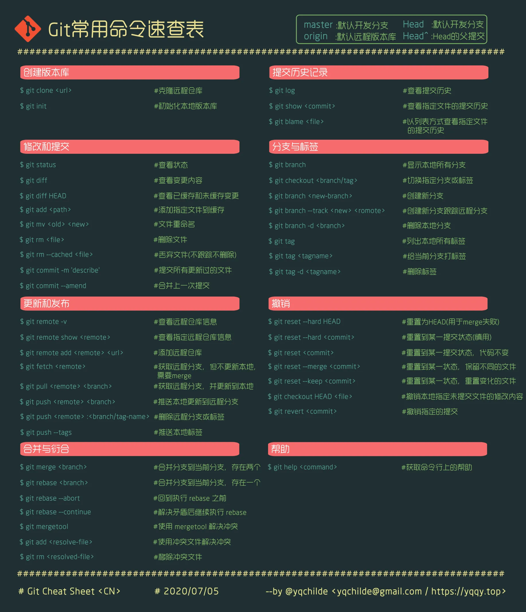

# Git 命令清单



## 1. 新建 git 仓库

```shell
# 在当前目录新建一个 Git 仓库
git init

# 新建一个目录，将其初始化为 Git 仓库
git init [project-name]

# 下载一个项目和它的整个代码历史
git clone [url]
```

## 2. 配置

```shell
# 显示当前的Git配置
git config --list

# 设置提交代码时的用户信息
git config [--global] user.name "名称"
git config [--global] user.email "邮箱地址"
```

## 3. 向暂存区添加 / 删除文件

```shell
# 添加指定文件或指定目录到暂存区
git add [文件路径 / 目录路径]

# 添加所有文件到暂存区
git add .

# 停止追踪指定文件并保留在工作区
git rm --cached [文件路径]

# 删除工作区文件并且提交到暂存区
git rm [文件路径]
```

## 4. 代码提交

```shell
# 提交暂存区到仓库区
git commit -m [提交信息]

# 替换上一次 commit（如无代码改动，就重写上一次 commit 的提交信息）
git commit --amend -m [提交信息]
```

## 5. 分支

```shell
# 列出所有本地分支
git branch

# 列出所有远程分支
git branch -r

# 列出所有本地分支和远程分支
git branch -a

# 新建一个分支，但依然停留在当前分支
git branch [分支名]

# 新建一个分支，并切换到该分支
git checkout -b [分支名]

# 新建一个分支，指向指定commit
git branch [分支名] [commit id]

# 新建一个分支，与指定的远程分支建立追踪关系
git branch --track [分支名] [远程分支名]

# 新建一个空白分支
git checkout --orphan [分支名]

# 切换到指定分支，并更新工作区
git checkout [分支名]

# 切换到上一个分支
git checkout -

# 合并指定分支到当前分支
git merge [分支名]

# 删除分支
git branch -d [分支名]

# 删除远程分支
git push origin --delete [分支名]
git branch -dr [remote/分支名]
```

## 6. 标签

```shell
# 列出所有 tag
git tag

# 根据当前 commit 创建一个 tag
git tag [tag]

# 根据指定 commit 创建一个 tag
git tag [tag] [commit id]

# 删除本地 tag
git tag -d [tag]

# 删除远程 tag
git push origin :refs/tags/[tagName]

# 查看 tag 信息
git show [tag]

# 提交指定 tag
git push [remote] [tag]

# 提交所有 tag
git push [remote] --tags

# 新建一个分支，指向某个tag
git checkout -b [分支名] [tag]
```

## 7. 查看信息

```shell
# 显示变更的文件
git status

# 显示当前分支的版本历史
git log

# 显示commit历史，以及每次commit发生变更的文件
git log --stat

# 搜索提交历史，根据关键词
git log -S [keyword]

# 显示某个文件的版本历史，包括文件改名
git log --follow [文件路径]
git whatchanged [文件路径]

# 显示指定文件相关的每一次diff
git log -p [文件路径]

# 显示过去5次提交
git log -5 --pretty --oneline

# 显示所有提交过的用户，按提交次数排序
git shortlog -sn

# 显示指定文件是什么人在什么时间修改过
git blame [file]

# 显示暂存区和工作区的差异
git diff

# 显示工作区与当前分支最新 commit 之间的差异
git diff HEAD

# 显示今天你写了多少行代码
git diff --shortstat "@{0 day ago}"

# 显示当前分支的最近几次提交
git reflog
```

## 8. 提交

```shell
# 下载远程仓库的所有变动
git fetch [remote]

# 显示所有远程仓库
git remote -v

# 显示某个远程仓库的信息
git remote show [remote]

# 增加一个新的远程仓库，并命名
git remote add [name] [url]

# 删除远程仓库
git remote remove [name]

# 查看远程仓库地址
git remote get-url [name]

# 取回远程仓库的变化，并与本地分支合并
git pull [remote] [branch]

# 上传本地指定分支到远程仓库
git push [remote] [branch]

# 强行推送当前分支到远程仓库，即使有冲突
git push [remote] --force

# 推送所有分支到远程仓库
git push [remote] --all
```

## 9. 撤销

```shell
# 重置暂存区的指定文件，与上一次 commit 保持一致，但工作区不变
git reset [文件路径]

# 重置暂存区与工作区，与上一次 commit 保持一致
git reset --hard

# 重置当前分支的指针为指定 commit，同时重置暂存区，但工作区不变
git reset [commit id]

# 重置当前分支的 HEAD 为指定 commit，同时重置暂存区和工作区，与指定 commit 一致
git reset --hard [commit id]

# 重置当前 HEAD 为指定 commit，但保持暂存区和工作区不变
git reset --keep [commit id]

# 新建一个 commit，用来撤销指定 commit 后者的所有变化都将被前者抵消，并且应用到当前分支
git revert [commit id]

# 暂存操作
# 只暂存被追踪的文件
git stash
# 暂存所有文件并添加说明
git stash [save '说明信息'] [-u]
# 查看 stash 列表
git stash list
# 取出最近一次的 stash
git stash apply
# 取出 stash 列表里对应数字的暂存
git stash apply 数字
# 取出并删除最近一次的 stash
git stash pop
# 清空所有 stash
git stash clear
```

## 10. 日志

```shell
# 查看提交过的完整日志
git log

# 查看精简日志（精简版本号和提交信息）
git log --oneline

# 查看精简日志（完整版本号和提交信息）
git log --pretty=oneline

# 查看所有分支的所有操作记录（包括被删除的 commit 记录和 reset 操作）
git reflog
```

## 数据来源
* [阮一峰 - 常用 Git 命令清单](https://www.ruanyifeng.com/blog/2015/12/git-cheat-sheet.html)
* [{{ $frontmatter.author }} - {{ $frontmatter.title }}](https://mm-notes.netlify.app/workflow/git/command)