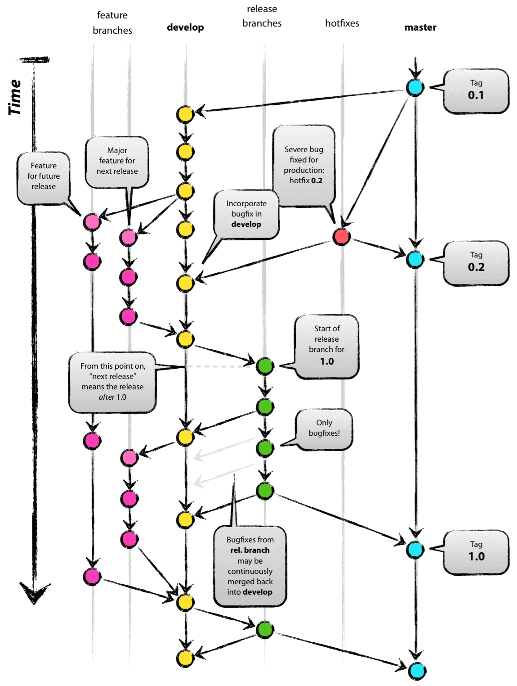

# 编程规范

## 命名规范

命名规范是编程范式中最重要的一部分，他直接影响到代码的可读性和可维护性

> [!IMPORTANT] 常见的命名形式
>
> * `camelCase` 小驼峰命名法
> * `PascalCase` 大驼峰式命名法（首字母大写）
> * `snake_case` 下划线命名法
> * `kebab-case` 短横线命名法
> * `UPPER_CASE` 大写命名法

## Git规范

### 分支管理和命名规范

如下图所示，是Git分支管理规范



* `master / main` 主分支
  * 用于存放对外发布的稳定版本（不能直接在该分支上开发，只能从 `develop` 分支合并过来）
* `develop` 开发分支
  * 用于存放最新的开发版本（所有新功能都以该分支来创建自己的开发分支，该分支只做合并操作，不能直接在该分支上开发）
* `feature` 功能分支
  * 用于开发新功能（在 `develop` 上创建分支，以自己开发功能模块命名，功能测试正常后合并到 `develop` 分支）
  * `feature` 分支推荐命名规范：`feature/日期-开发者-功能模块`
* `hotfix` 紧急 bug 修复分支
  * 用于修复线上版本的 bug（在 `master` 分支上创建，修复完成后合并到 `master`）
  * `hotfix` 分支推荐命名规范：`hotfix/日期-开发者-修复内容`
* `release` 预发布分支
  * 用于当需要为发布新版做准备时（在 `develop` 上创建分支，以版本号命名，测试完成后合并到 `master` 和 `develop`）
  * `release` 分支推荐命名规范：`release/版本号`

在日常开发中，通常使用可视化工具 `sourcetree` 进行版本管理

### commit提交规范

git commit message的格式

```txt
<type>(<scope>): <subject>
<body>
<footer>
```

* `type` 类型
* `scope` commit的影响范围
* `subject` commit的描述
* `body` commit的详细描述
* `footer` 关联issue

举例子：

```txt
feat(auth): add user authentication feature

- Implemented user login and registration
- Added JWT token for authentication

Fixes #123
```

|     type     | 含义                   |
| :----------: | -------------------- |
|     feat     | 新功能                  |
|     fix      | 修复 bug               |
|     docs     | 文档类改动                |
|    style     | 代码格式改动，或其他样式改动       |
|   refactor   | 重构（既不是新增功能，也不是修复bug） |
|     perf     | 性能优化相关               |
|     test     | 单元测试                 |
|    build     | 构建工具或者依赖项的改动         |
|      ci      | 修改项目持续集成流程           |
|    chore     | 其他类型的提交              |
|    revert    | 恢复或还原相关提交            |
| wip \| draft | 托管平台对应的草稿标识          |